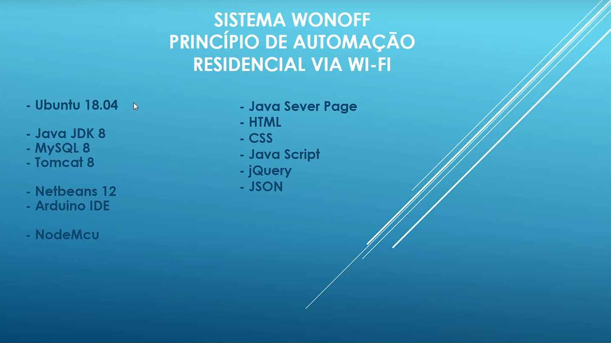

Automacao_Residencial_ESP8266_Cpp_Java_Tomcat_MySQL

O comando e monitoramento do dispositivo se dará através de uma página web hospedada na nuvem da UOL Host, onde em uma máquina virtual do Ubuntu 18.04 foram instalados o java JDK 8, o servidor web Tomcat 8 e o sistema de gerenciamento de banco de dados MySQL 8.
O dispositivo de endpoint escolhido foi o NodeMCU com ESP8266, uma plataforma de internet das coisas de baixo custo, que pode ser programada pelo Arduino IDE.
O usuário na interface web poderá controlar um led RGB conectado nas saidas do dispositivo, simulando uma lâmpada multi-cor.
Periodicamente o valor de um potenciômetro, simulando o nível da caixa d'água, conectado na entrada analógica do NodeMCU, enviará os dados para serem salvos no banco de dados do servidor em núvem e a cada 10 segundos atualizado na interface web.
Podem ser cadastrados mais de um dispositivo e o usuário poderá lista-los, para editar enviando uma nova cor ao dispositivo ou deleta-la do banco de dados.
É possível listar o histórico de nível (histórico do potenciômetro) introduzindo um intervalo de dia, hora e minutos na interface web.

[Vídeo Demonstrativo](https://www.youtube.com/watch?v=mHW7HrxmpXs&t=486s)
